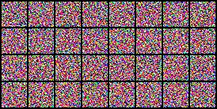
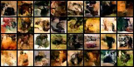
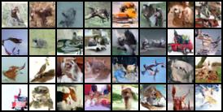
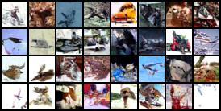

# SFDDM

This is the code for the algorithm proposed by our paper:

"Chi Hong, Jiyue Huang, Robert Birke, Dick Epema, Stefanie Roos, and Lydia Y. Chen.
"Single-fold Distillation for Diffusion models." In European Conference on Machine Learning and Principles and Practice of Knowledge Discovery in Databases (ECML PKDD), 2025."

This project relies on https://github.com/lucidrains/denoising-diffusion-pytorch/tree/main to implement diffusion models. To facilitating users, we provide a copy in this repo.

Then you will get the pretrained diffusion model on imagenet, and you can run the experiments. You may replace the pretrained models by yours.

An example of running the algorithm is shown in "run.py".

# Downloading LSUN datasets
The teacher and the student model of this project can be trained by LSUN datasets like "bedroom" and "church".
Before the training, you may download the dataset into the default directory of this project '../datasets'.
The method of downloading LSUN datasets is show in https://github.com/fyu/lsun.

If you want to use datasets other than cifar10, you need to download the datasets and train the teacher and the student model.

- To train the teacher: see "train_teacher_diffusion()" in the "run.py".
- To train the student: see "train_student()" in the "run.py".

# Before running
To run the algorithm, please extract the pretrained diffusion model in "./trained_model". Please use the command
- sudo apt install p7zip-full
- cd trained_model
- 7z x model.7z.001

# To run this file
The project is developed under python 3.8.10

- pip install -r requirements.txt
- python run.py

# Expected Results
After running the example "run.py", we can get the following expected Results. Please note that due to randomness, the final results you have may differ slightly from what is shown here.

- the distilled student generators will be saved in "./saved_models"
- the sampling results from the student will be saved in "./sampling_res"
- The PSNR value increases with the number of training epochs, indicating that the image quality of the student is approaching that of the teacher.
- sampling from the student before distillation

- sampling from the student after one epoch of distillation

- sampling from the student after 10 epochs of distillation

- sampling from the teacher

